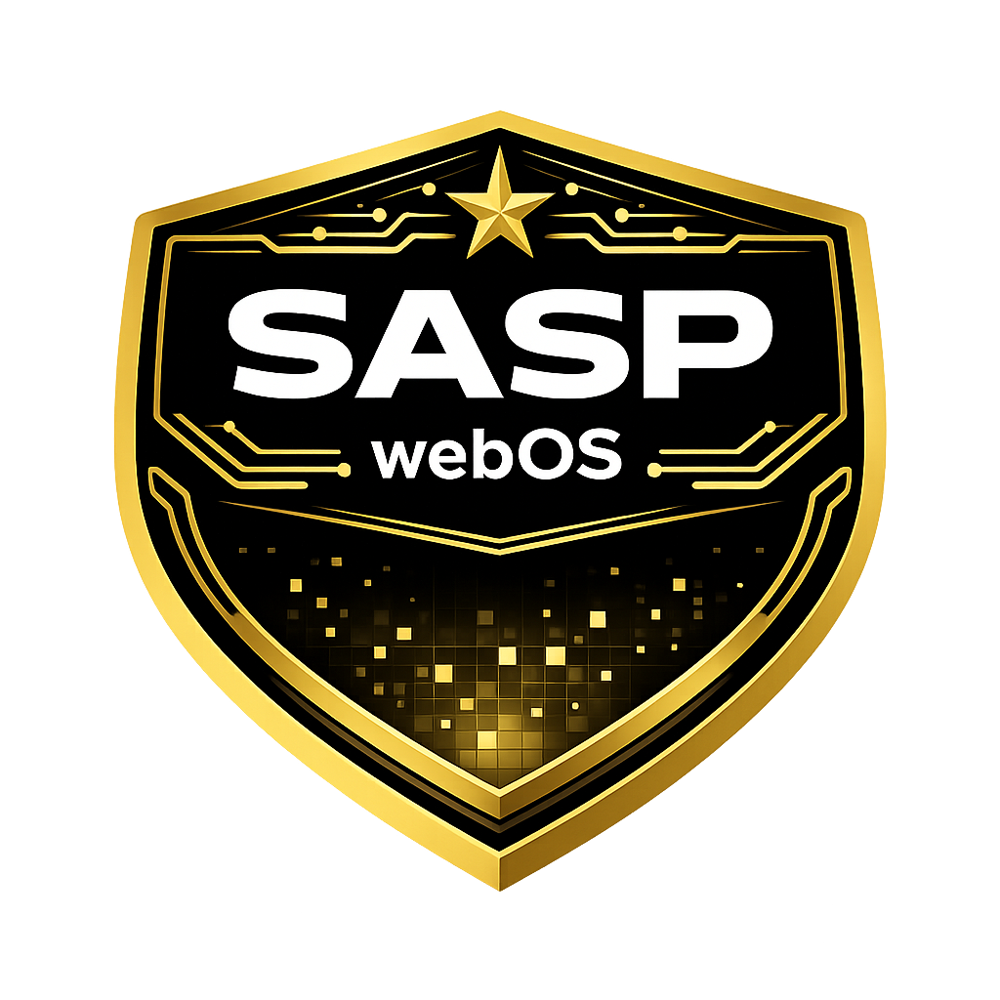

<div align="center">
  

  <h1>SASP webOS</h1>
  <p><em>Webové desktopové prostředí pro San Andreas State Police</em></p>

  
  
  
  
  
</div>

---

## O projektu

**SASP webOS** je plnohodnotné webové desktopové prostředí navržené speciálně pro potřeby **San Andreas State Police** v rámci FiveM / GTA RP komunity. Nabízí věrný zážitek připomínající operační systém — kompletní s bootovací sekvencí, přihlašovací obrazovkou a plně interaktivním desktopem přímo v prohlížeči.

Systém sjednocuje veškeré operativní nástroje SASP na jednom místě a umožňuje příslušníkům pohodlně pracovat s MDT terminálem, psát poznámky, počítat pokuty nebo tvořit vizuální záznamy — a to vše v rámci jednoho elegantního rozhraní.

---

## Funkce

### Desktop prostředí
- **Animovaný boot screen** — simulace BIOS/kernel boot sekvence s konzolí
- **Přihlašovací obrazovka** — lock-screen styl s číslem odznaku, jménem a příjmením
- **Správce oken** — přesouvání, změna velikosti, minimalizace, maximalizace, zavírání
- **Taskbar** — připnuté aplikace, přehled otevřených oken, hodiny
- **Launcher (Start Menu)** — vyhledávání aplikací, správa připnutých aplikací
- **Plocha s ikonami** — drag & drop, přichycení do mřížky, rubber-band výběr
- **Složky a dokumenty** — vytvářejte vlastní složky a textové dokumenty přímo na ploše
- **Průzkumník souborů** — stromová navigace, breadcrumb, drag & drop mezi složkami
- **Koš** — bezpečné mazání s možností obnovení
- **Sticky Notes** — přilepovací poznámky přímo na ploše
- **Kontextové menu** — pravé tlačítko myši s relevantními akcemi
- **Témata** — moderní tmavé téma + Windows 98 retro téma
- **Tapeta plochy** — nahrání vlastní tapety
- **Profilový avatar** — nahrání vlastní fotky profilu
- **Nastavení systému** — přístupné přes launcher nebo taskbar

### Autentizace
- Přihlášení pomocí čísla odznaku, jména a příjmení
- Volitelné zapamatování přihlášení (`localStorage`)
- Session persistence — přihlášení přetrvá v rámci otevřeného tabu

---

## Aplikace

| Ikona | Název | Popis |
|:-----:|-------|-------|
| 🛡️ | **MDT – Terminál** | Plnohodnotný terminál pro práci s trestním zákoníkem. Vyhledávání paragrafů, přidávání sazeb, generování protokolů, správa zákonů (admin). |
| 📝 | **Notepad** | Rychlé textové poznámky s formátováním. Automatické ukládání do `localStorage`. |
| 🧮 | **Kalkulačka** | Standardní kalkulačka pro výpočet pokut a jiných hodnot. |
| 🎨 | **Malování** | Jednoduchý grafický editor — vrstvy, nástroje, export obrázku. |

---

## Technologie

<div align="center">


</div>

| Technologie | Použití |
|-------------|---------|
| **HTML5** | Sémantická struktura všech stránek |
| **CSS3** | Kompletní custom design, animace, CSS proměnné pro témata |
| **Vanilla JavaScript** | Veškerá logika — žádné frameworky, žádné závislosti |
| **JSON** | Datový model trestního zákoníku (`laws.json`) |
| **Font Awesome 6** | Ikony napříč celým rozhraním |
| **Google Fonts – Inter** | Typografie UI |
| **localStorage / sessionStorage** | Persistentní ukládání dat na straně klienta |

> Projekt záměrně nepoužívá žádné JS frameworky ani build systémy. Funguje čistě jako statické soubory — stačí otevřít `index.html`.

---

## Struktura projektu

```
sasp-hub/
├── index.html              # Hlavní stránka — boot, login, desktop
├── assets/
│   ├── sasp_logo.png       # Logo SASP (boot screen, tapeta)
│   └── webos_logo.png      # Logo webOS
├── css/
│   └── style.css           # Kompletní styly desktopového prostředí
├── js/
│   ├── desktop.js          # Jádro systému — veškerá logika desktopu
│   └── themes.js           # Engine pro správu témat
└── apps/
    ├── mdt/                # MDT Terminál (trestní zákoník)
    │   ├── index.html
    │   ├── js/app.js
    │   ├── css/style.css
    │   └── data/laws.json  # Databáze zákonů
    ├── notepad/            # Textový editor
    │   └── index.html
    ├── kalkulator/         # Kalkulačka
    │   └── index.html
    ├── malovani/           # Grafický editor
    │   └── index.html
    └── basicnote/          # Interní komponenta (textové dokumenty na ploše)
        └── index.html
```

---

## Spuštění

Projekt nevyžaduje žádnou instalaci ani build krok.

```bash
# Klonování repozitáře
git clone https://github.com/your-org/sasp-hub.git

# Přechod do složky
cd sasp-hub

# Otevřít přímo v prohlížeči — nebo spustit přes lokální server (doporučeno)
# např. Live Server (VS Code), http-server (Node.js) apod.
```

> **Tip:** Kvůli `localStorage` a iframeům doporučujeme spouštět přes lokální HTTP server, nikoliv přímo jako `file://`.

---

## Přihlášení

Po startu systému zadejte do přihlašovací obrazovky:

| Pole | Popis |
|------|-------|
| **Číslo odznaku** | Váš identifikátor (např. `1042`) |
| **Jméno** | Křestní jméno |
| **Příjmení** | Příjmení |

Zaškrtnutím **"Zapamatovat přihlášení"** zůstanete přihlášeni i po zavření prohlížeče.

---

## Klávesové zkratky & tipy

- **Dvojklik** na ikonu = otevření aplikace
- **Pravé tlačítko** na ploše nebo ikoně = kontextové menu
- **Přetažení** ikon = přemístění na ploše (snap to grid)
- **Dvojklik** na titlebar okna = maximalizovat / obnovit
- **Přetažení** souboru na koš = smazání do koše

---

## Licence

Distribuováno pod licencí **MIT**.  
Vytvořeno pro interní použití komunity **San Andreas State Police**.

---

<div align="center">
  <sub>SASP webOS · v1.0.0-STABLE · SAN ANDREAS STATE POLICE · CLASSIFIED</sub>
</div>
